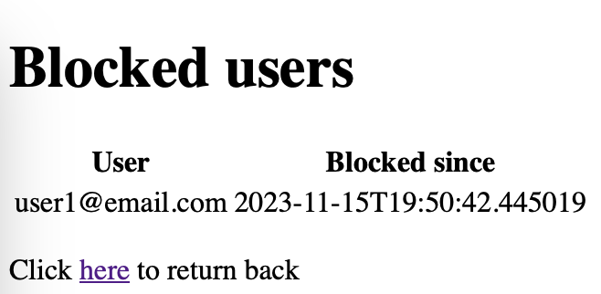

# Runbook

## Background

App uses the following things:

- Docker Desktop with PostgresQL DB.
- Custom db schema (no default one
  that [Spring Security expects](https://docs.spring.io/spring-security/reference/servlet/appendix/database-schema.html))
- Bcrypt hash algorithm for password storing.
  By default, Bcrypt has built-in salt implementation (as an example, you may see two
  users `user1@email.com` & `user1@email.com` with the same password `password` but different hashes
  in db).
- `CacheService` is local cache. Proper production cache implementation must be distributed (Redis,
  MemCache
  etc.).

## Step 0: Prepare Docker Compose preparation

`compose.yaml` contains postgres relates containers.

Start `compose.yaml` as `docker compose up -d`
> Please pay attention: you may expect that Spring Boot is able to start Compose automatically as
> part
>
of [Spring Boot 3.1 Docker compose support](https://spring.io/blog/2023/06/21/docker-compose-support-in-spring-boot-3-1).
> However, newest Docker Desktop
> has [issue](https://github.com/spring-projects/spring-boot/issues/37982) with Spring Boot 3.1.5.

## Step 1: Start app

`./mvnw spring-boot:run`. App should start on http://localhost:8080

## Step 2: Login for user1@email.com user

Login with the following credentials:

- Login: user1@email.com
- Password: password

User has access to the following pages:

- index
- info (user has `VIEW_INFO` role)
- about
- blocked
- generate secret
- log out

## Step 3: Login for user2@email.com user

Log out for user1@email.com user and login for `user2@email.com`.

- Login: user2@email.com
- Password: password

User has access to the following pages:

- index
- admin (user has `VIEW_ADMIN` role)
- about
- blocked
- log out

## Step 4: Login for admin@email.com user

Log out for user2@email.com amd login for `admin@email.com`:

- Login: admin@email.com
- Password: admin

User has access to the following pages:

- index
- info (user has `VIEW_INFO` role)
- admin (user has `VIEW_ADMIN` role)
- about
- blocked
- generate secret
- log out

## Step 5: Brute Force Protection

Log out for admin@email.com and try to log in for `user1@email.com` with wrong password 3 times.

For 1-3 failed attempt you will see `Bad credentials` error.

On 4th attempt, error will change to `User is blocked` for 60 seconds. You may see blocked users
here: http://localhost:8080/blocked

After 60 seconds, you may log in again.

Another scenario, is to log less than 3 time with wrong password. After that, successfully log in
with right password.

## Step 6: One time secret share

`user1@email.com` & `admin@email.com` have `STANDARD` authority. `user2@email.com` - not.
Let's log in under `user1@email.com` and go to `Generate secret` tab. There, generate secret
phrase `test`. After submitting secret phase, the link will be generated:

If we log out and log in under `user2@email.com` and try to go to `Generate secret` tab or use the
link from above, the following error occurs:

But if we log in under `admin@email.com` with proper authority, then:

> Please pay attention: user1 secret is encoded in DB.

> Http link with a secret is generated with help of UUID.
